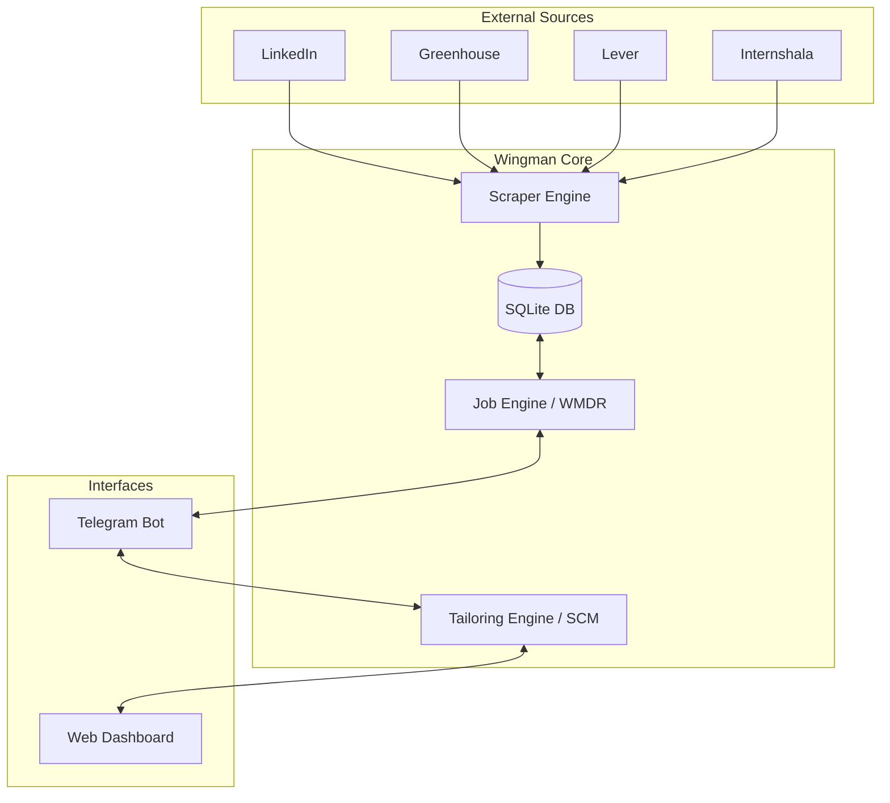
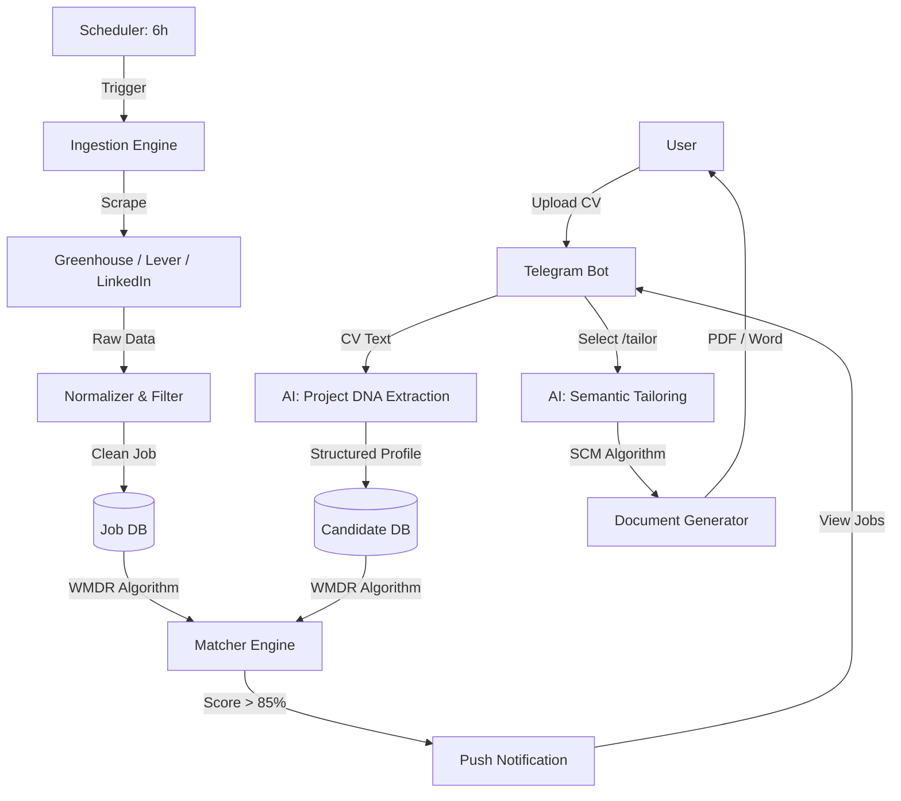
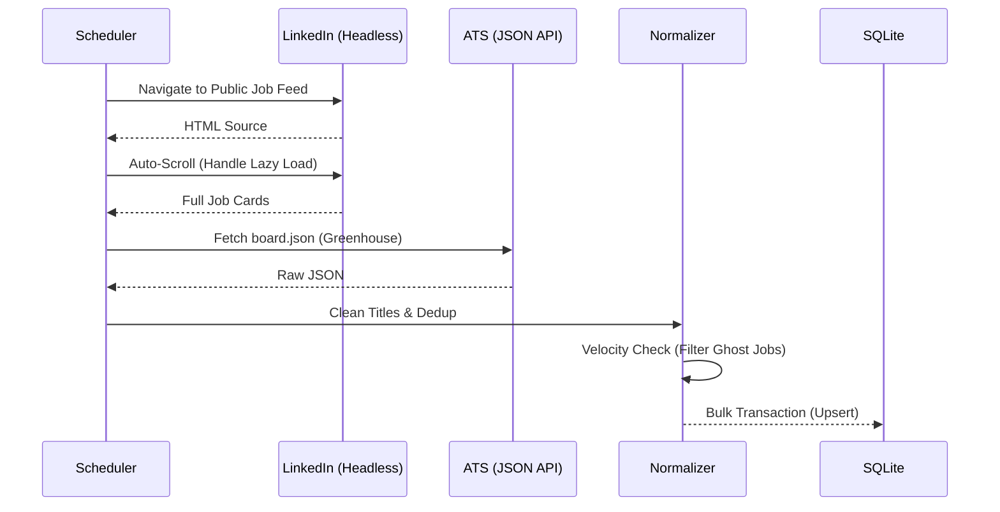
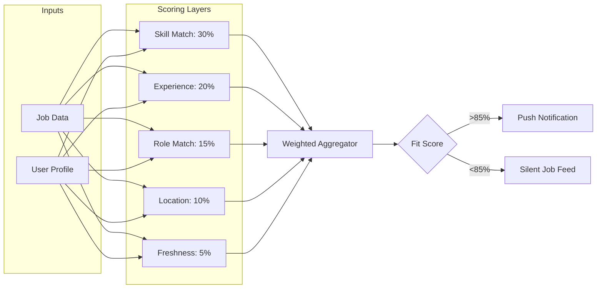
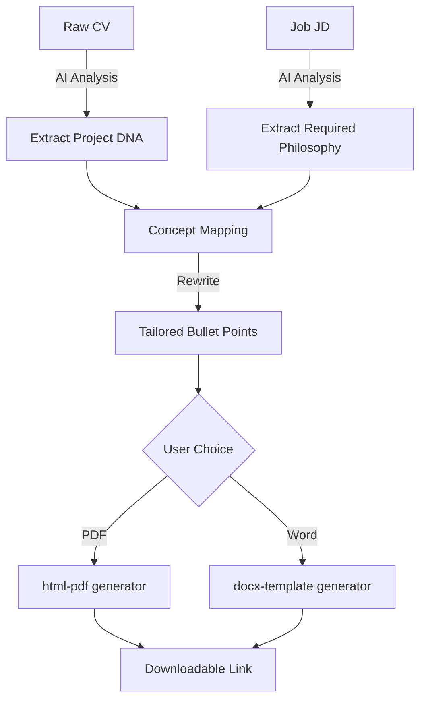
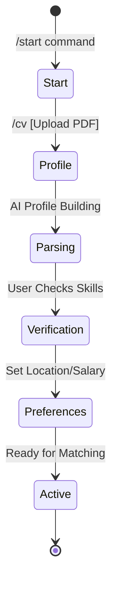

# 🚀 Wingman AI: The Ultimate Career Intelligence Engine

> **A Telegram-native career intelligence ecosystem powered by OpenAI/Claude and Playwright.**

Wingman AI isn't just a bot; it's a fundamental shift in how human talent intersects with corporate requirements. It automates the "Black Hole" of job hunting by using advanced Large Language Models (LLMs) to understand engineering DNA and automate discovery.

---

## ✨ Core Features

- **🎯 WMDR Matching Engine:** Evaluate jobs across 7 weighted dimensions (Skills, Experience, Location, Freshness, etc.) to get an instant Fit Score.
- **📄 SCM Resume Tailoring:** Generates heavily tailored, ATS-friendly resumes in **PDF** or **Word** format by semantically mapping your project DNA to the JD.
- **🔍 Autonomous Scout Service:** A background agent that scrapes 100+ company boards (Greenhouse, Lever, LinkedIn) every 6 hours and notifies you of high-score matches.
- **🇮🇳 Indian Unicorn Focus:** Specialized support for top Indian tech hubs (Bangalore, Hyderabad, etc.) and unicorns like Swiggy, Zomato, Razorpay, and Cred.
- **🛡️ Anti-Bot Scraper:** Built-in Playwright scraper with residential proxy support to securely bypass modern anti-bot measures on LinkedIn and Internshala.

---

## 📐 High-Level Architecture

Wingman uses a modular, event-driven architecture designed for high throughput and semantic precision.



---

## 🔄 End-to-End Workflow



---

## 🛠️ The Algorithms (The "Secret Sauce")

### 1. WMDR (Weighted Multi-Dimensional Ranking)
The matching engine weighs 7 dimensions to predict success:
*   **30% Skill Match:** Fuzzy logic tech stack overlap.
*   **20% Experience Match:** Seniority/Gap analysis.
*   **10% Growth Upside:** Identifying "Stretch" opportunities.

### 2. SCM (Semantic Contextual Mapping)
Instead of simple keyword swapping, SCM analyzes the "Philosophy" of a JD (e.g., scale, low latency) and rewrites project bullet points to emphasize truthful alignment.

---

## 🚀 Setup & Installation

### Prerequisites
- Node.js 20+
- Telegram Bot Token (@BotFather)
- OpenAI or Claude API Key (or OpenRouter)

### Quick Start
1.  **Clone the Repo:**
    ```bash
    git clone https://github.com/adityakumargupta27/wingman.git
    cd wingman
    npm install
    ```
2.  **Environment Config:**
    Create a `.env` file:
    ```bash
    TELEGRAM_TOKEN=your_token
    OPENROUTER_API_KEY=your_key
    DB_PATH=./data/wingman.db
    ```
3.  **Run the Bot:**
    ```bash
    npm run start
    ```

---

## 📈 Financial Roadmap (Scaling in India)
| Category | Monthly Burn (INR) |
| :--- | :--- |
| **Residential Proxies** | ₹20,000 |
| **LLM Tokens (High Tier)**| ₹75,000 |
| **Infrastructure** | ₹5,000 |
| **Total Runway** | **₹1,00,000/mo** |

---

## 📄 License
MIT License • Build with grit in India by **Aditya Kumar Gupta**.

---

## 🔍 Deep Dive: Internal Processes

### 1. Job Ingestion (The Scraper)
The system handles a hybrid fetch strategy to ensure high-fidelity data from both structured APIs and dynamic web pages.



### 2. Match Scoring (WMDR Algorithm)
A multi-layered evaluation that calculates a candidate's success probability.



### 3. Resume Tailoring (SCM Algorithm)
How semantic mapping bridges the gap between project history and future JD requirements.



### 4. User Onboarding Lifecycle
The state-machine for a new candidate entering the ecosystem.


